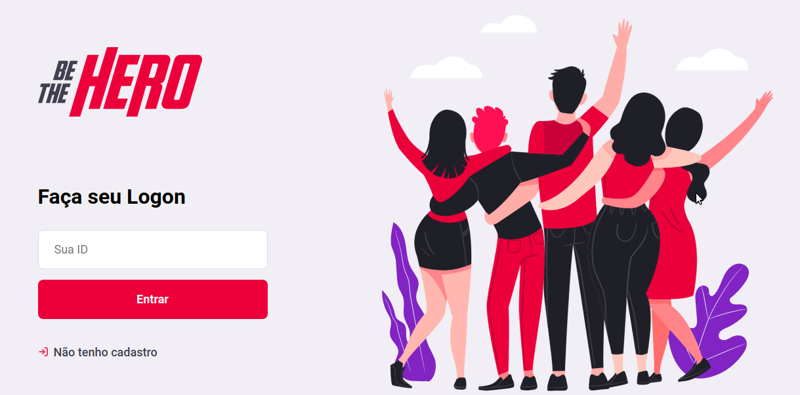
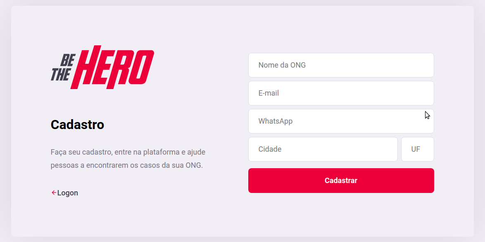
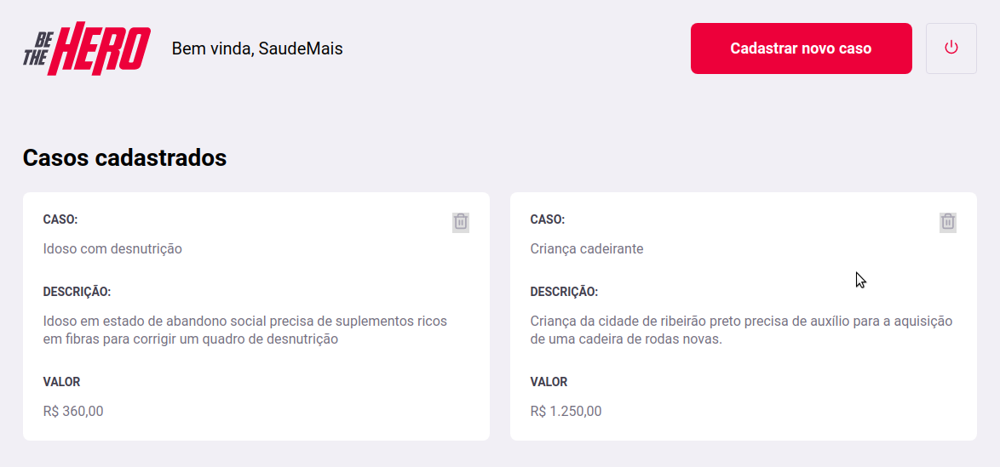
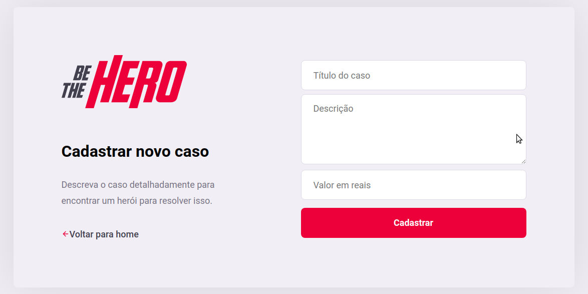

# Semana OmniStack 11 - Rocketseat

Workshop totalmente gratuito realizado do dia 23/03/2020 ao dia 27/03/2020 para apresentar a stack NodeJs, React, React Native e Expo em um projeto com o objetivo de desenvolver uma aplicação web e mobile usando as tecnologias da stack.

A aplicação se chama Be the Hero e é um portal para ONGs se cadastrarem e lançar suas ações e as despesas decorrentes, e os usuário poderam via aplicação mobile escolher uma das despesas e entrar em contato para se colocar a disposição ou auxiliar financeiramente.

O foco é o aprendizado das tecnologias que estão na stack.

## Imagens da aplicação

### Tela de logon

### Tela de Cadastro de ONGs

### Tela de Lista de Casos

### Tela de Cadastro de Casos
